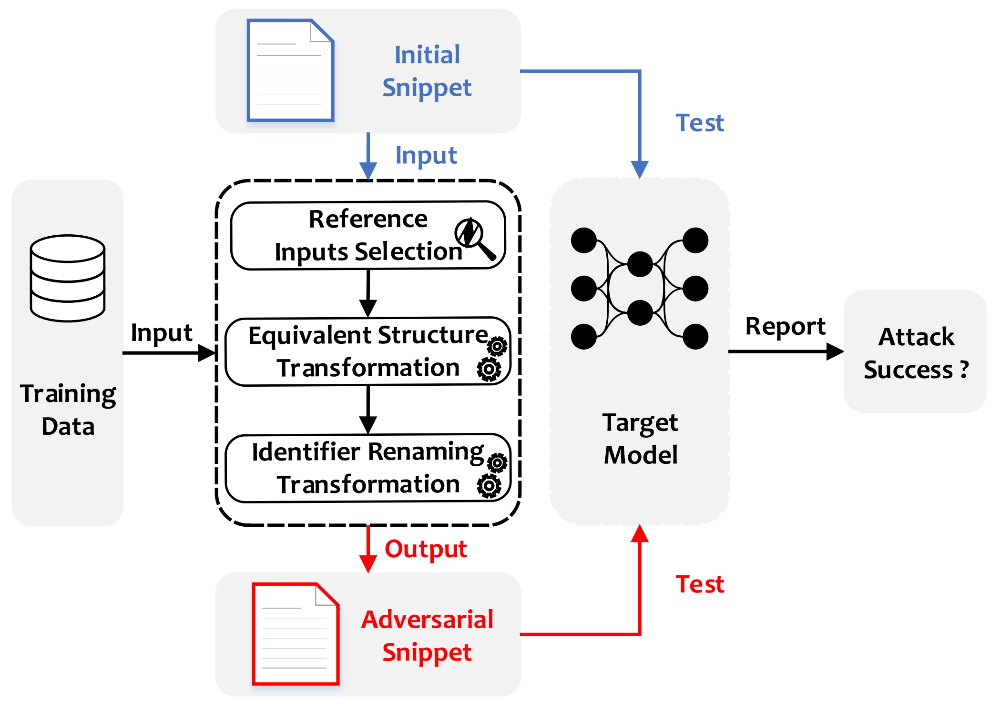
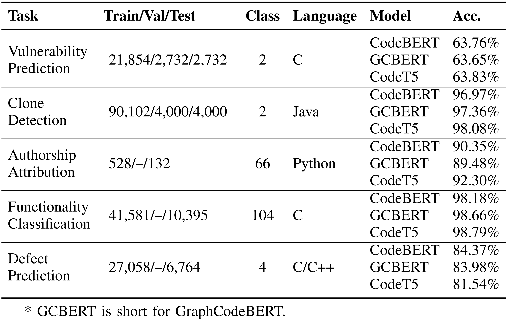
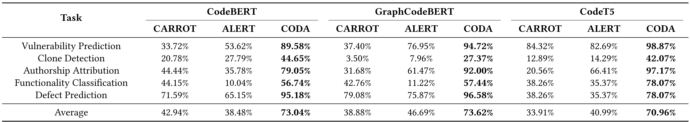
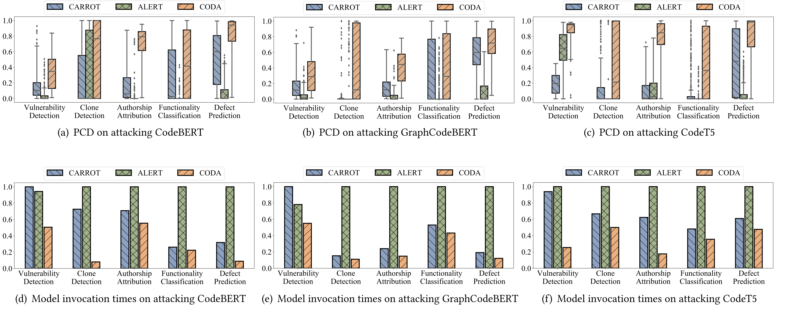
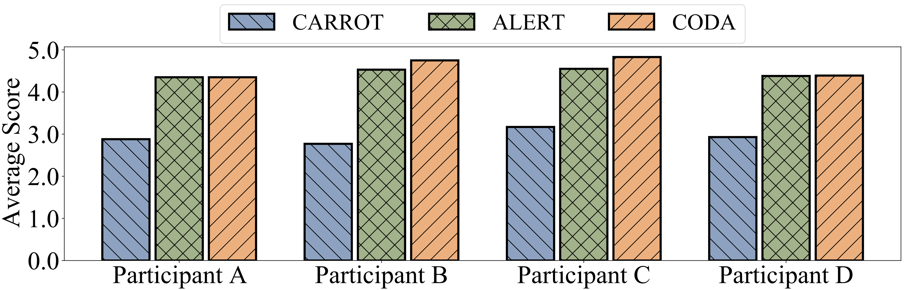
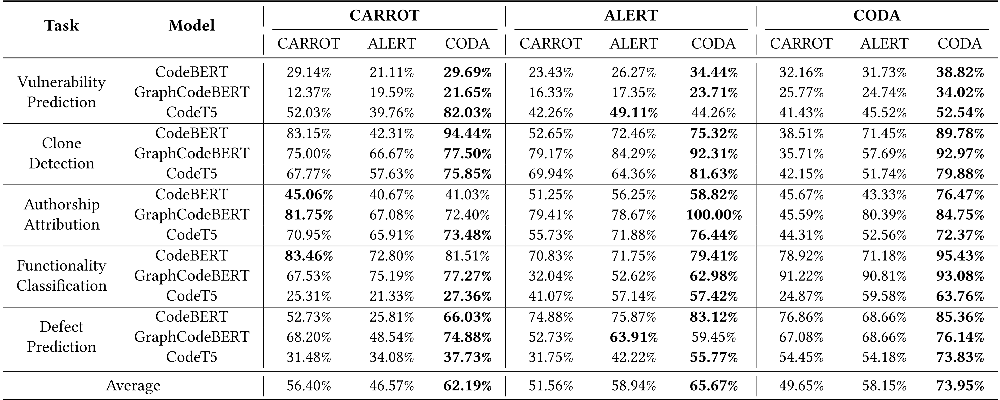
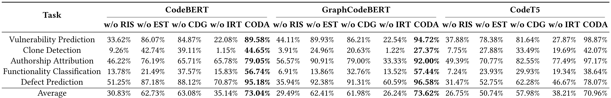
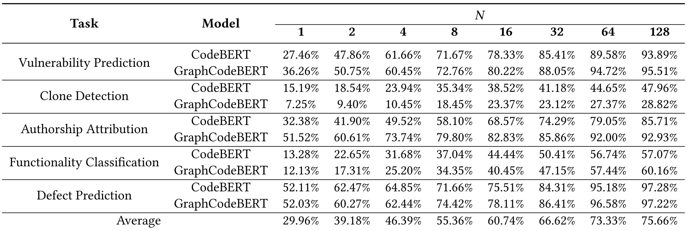

# CODA

- [Overview](#overview)
  - [Code structure transformation](#code-structure-transformation)
  - [Folder Structure](#folder-structure)
- [Environment Configuration](#environment-configuration)
  - [Docker](#docker)
  - [Subjects](#subjects)
- [Experiments](#experiments)
  - [Demo](#demo)
  - [Running Experiments](#running-experiments)
  - [Experimental Results](#experimental-results)
- [Acknowledgement](#acknowledgement)


## Overview


--- ---


### Code Structure Transformation
The descriptions and examples of code structure transformation rules in CODA.
> 1. ***R1-loop***: equivalent transformation among for structure and while structure
> > (1) `while` loop → `for` loop
> >   
> > (2) `for` loop → `while` loop
> 2. ***R2-branch***: equivalent transformation between if-else(-if) structure and if-if structure
> > (1) `if-else-(if)`  → `if-if` 
> >   
> > (2) `if-if`  → `if-else-(if)` 
> 3. ***R3-calculation***: equivalent numerical calculation transformation, e.g., ++, --, +=, -=, *=, /=, %=, <<=, >>=, &=, |= , ˆ =
> > (1) `i++`  ↔ `i = i + 1` 
> >
> > (2) `i--`  ↔ `i = i - 1` 
> >
> > (3) `i += j`  ↔ `i = i + j` 
> >
> > (4) `i -= j`  ↔ `i = i - j` 
> >
> > (5) `i *= j`  ↔ `i = i * j` 
> >
> > (6) `i /= j`  ↔ `i = i / j` 
> >
> > (7) `i %= j`  ↔ `i = i % j` 
> >
> > (8) `i <<= j`  ↔ `i = i << j` 
> >
> > (9) `i >>= j`  ↔ `i = i >> j` 
> >
> > (10) `i &= j`  ↔ `i = i & j` 
> >
> > (11) `i |= j`  ↔ `i = i | j` 
> >
> > (12) `i ^= j`  ↔ `i = i ^ j` 
> 4. ***R4-constant***: equivalent transformation between a constant and a variable assigned by the same constant
> > (1) Any literal expression (string, number, character, or boolean) can be replaced with a constant variable with the same value: `if("Hello, World!");` ↔ `String i = "Hello, World!"; println(i);`


### Folder Structure
```
.
│  README.md
│  utils.py
│  
├─attack
│  ├─AuthorshipAttribution
│  │  │  README.md
│  │  ├─code
│  │  └─dataset
│  │          
│  ├─CloneDetection
│  │  │  README.md
│  │  ├─code  
│  │  └─dataset
│  │          
│  ├─DefectPrediction
│  │  │  README.md
│  │  ├─code
│  │  └─dataset
│  │          
│  ├─FunctionalityClassification
│  │  │  README.md
│  │  ├─code
│  │  └─dataset
│  │          
│  └─VulnerabilityPrediction
│      │  README.md
│      ├─code
│      └─dataset       
├─figs 
└─python_parser
    │  pattern.py
    │  run_parser.py
    └─parser_folder
        ├─tree-sitter-c          
        ├─tree-sitter-cpp       
        ├─tree-sitter-java         
        └─tree-sitter-python
```
Under each subject's folder in `attack/` (`AuthorshipAttribution/`, `CloneDetection/`, `DefectPrediction/`, `FunctionalityClassification/`, and `VulnerabilityPrediction/`), there are two folders (`code/` and `dataset/`) and one file (`README.md`). The original dataset and data processing programs (`get_reference.py`) are stored in the `dataset/` directory. The `code/` directory contains the attack codes (`attack.py` and `attacker.py`). The `README.md` file contains commands for data processing and attack. 
In the `python_parser/` directory, there is tree-sitter, a parse tree generation tool. And we use this tool to implement parsing tools in multiple programming languages (`C/C++`, `Java`, and `Python`).


## Environment Configuration
### Docker
Our experiments were conducted under Ubuntu 20.04. 
We have made a ready-to-use docker image for this experiment.

```shell
docker pull anonymous4open/coda:v1.4
```
Then, assuming you have NVIDIA GPUs, you can create a container using this docker image. 
An example:

```shell
docker run --name=coda --gpus all -it --mount type=bind,src=/home/coda,dst=/workspace anonymous4open/coda:v1.4
```

### Subjects
####  (1) Statistics of datasets and of target models.


--- --- ---

Download the datasets and models from this [Google Drive Link](https://drive.google.com/file/d/1D6eJ_5F0x8F6yoJ1F2oOX_qTWegtFRR8/view).


## Experiments
### Demo
Let's take the CodeBERT and Authorship Attribution task as an example. 
The `dataset` folder contains the training and evaluation data for this task. 
Run python attack.py in each directory to attack the deep code models.
E.g., run the following commands to attack the CodeBERT model on Authorship Attribution.

```shell
cd /root/Attack/CODA/AuthorshipAttribution/code/;
CUDA_VISIBLE_DEVICES=0 python attack.py --eval_data_file=../dataset/data_folder/processed_gcjpy/valid.txt --model_name=codebert;
```


### Running Experiments
We refer to the README.md files under each folder to prepare the dataset and attack models on different tasks. 


### Experimental Results

####  (1) Comparison results of Attack Success Rate (ASR) on attacking CodeBERT, GraphCodeBERT, and CodeT5 across five tasks.


--- --- ---


####  (2) Comparison results of prediction confidence decrement (PCD) and invocations on attacking CodeBERT, GraphCodeBERT, and CodeT5 .


--- --- ---


####  (3) Experimental results of the user study to evaluate naturalness of adversarial examples generated by three techniques. 


We further performed a Wilcoxon test at the 0.05 significance level between CODA and other method (CARROT or ALERT) to investigate whether the former was significantly better than the latter. The p-value for CODA and CARROT is 0.02 (that is less than 0.05), thus the results indicate that CODA has a statistically significant advantage over CARROT. While the p-value of CODA and ALERT is 0.63 (that is greater than 0.05), which indicates that there is no significant difference between CODA and ALERT.
--- --- ---


####  (4) Robustness improvement of the target models after adversarial fine-tuning.


--- --- ---


####  (5) We investigated the contribution of each main component in CODA, including reference inputs selection (RIS), equivalent structure transformations (EST), and identifier renaming transformations (IRT).


We constructed four variants of CODA:

• w/o RIS: we replaced RIS with the method that randomly selects 𝑁 inputs from training data as reference inputs.

• w/o EST: we removed EST from CODA, i.e., it directly performs identifier renaming transformations after selecting reference inputs.

• w/o CDG (code difference guidance in EST): we replaced the code-difference-guided strategy used for EST in CODA with randomly selecting rules for EST.

• w/o IRT: we removed IRT from CODA, i.e., it directly checks whether a successfully-attacking example is generated after equivalent structure transformations.

--- --- ---


#### (6) The influence of U in terms of average ASR across all the subjects.


--- ---


#### (7) The influence of N in terms of average ASR across all the subjects.


--- ---


## Acknowledgement
We are very grateful that the authors of Tree-sitter, CodeBERT, GraphCodeBERT, CodeT5, ALERT, and CARROT make their code publicly available so that we can build this repository on top of their code. 
