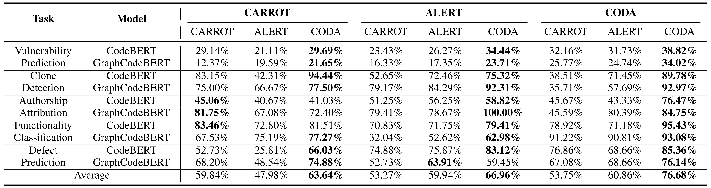

# CODA
### Code Difference Guided Attacking for Deep Code Models


--- ---

## Docker
Our experiments were conducted under Ubuntu 20.04. 
We have made a ready-to-use docker image for this experiment.
```shell
docker pull anonymous4open/coda:v1.2
```
Then, assuming you have NVIDIA GPUs, you can create a container using this docker image. 
An example:
```shell
docker run --name=coda --gpus all -it --mount type=bind,src=./coda,dst=/workspace anonymous4open/coda:v1.2
```

## Subjects
####  (1) Statistics of datasets and of target models.


--- --- ---

## Demo
Let's take the CodeBERT and Vulnerability Prediction task as an example. 
The `dataset` folder contains the training and evaluation data for this task. 
The numbers in the file name (e.g., "0_400") means that this file only contains substitutes for the first 400 code snippets in the datasets. 
We split the whole dataset into several chunks to process them in parallel.


Run python attack.py in each directory to attack the deep code models.

E.g., run the following commands to attack the CodeBERT model on Vulnerability Prediction.

```shell
cd /root/Attack/CODA/VulnerabilityPrediction/code/;
CUDA_VISIBLE_DEVICES=0 python attack.py --eval_data_file=../dataset/dataset/test_subs_0_400.jsonl --model_name=codebert;
```


## Running Experiments
We refer to the README.md files under each folder to attack models on different datasets. 


## Experimental Results

####  (1) Comparison results of Attack Success Rate (ASR) on attacking CodeBERT and GraphCodeBERT across five tasks.


--- --- ---


####  (2) Comparison results of prediction confidence decrement (PCD) and invocations on attacking CodeBERT and GraphCodeBERT.


--- --- ---


####  (3) Experimental results of the user study to evaluate naturalness of adversarial examples generated by three techniques.


--- --- ---


####  (4) Robustness improvement of the target models after adversarial fine-tuning.


--- --- ---


####  (5) We investigated the contribution of each main component in CODA, including reference inputs selection (RIS), equivalent structure transformations (EST), and identifier renaming transformations (IRT).


--- --- ---


#### (6) The influence of U in terms of average ASR across all the tasks.


--- ---


#### (7) The influence of N in terms of average ASR across all the tasks.


--- ---


## Acknowledgement
We are very grateful that the authors of CodeBERT, GraphCodeBERT, ALERT, and CARROT make their code publicly available so that we can build this repository on top of their code. 
