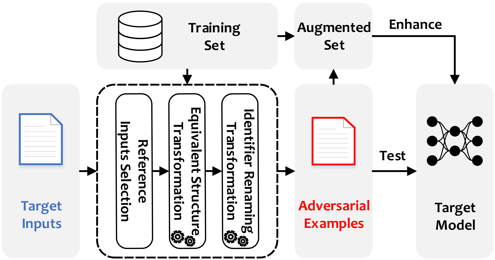

# CODA
***News: we are updating the latest code!***

To improve test effectiveness on deep code models, we propose a novel perspective by exploiting the code differences between reference inputs and the target input to guide the generation of adversarial examples. From this perspective, we design CODA, which reduces the ingredient space as the one constituted by structure and identifier differences and designs equivalent structure transformations and identifier renaming transformations to preserve original semantics. We conducted an extensive study on 15 subjects. The results demonstrate that CODA reveals more faults with less time than the state-of-the-art techniques (i.e., CARROT and ALERT), and confirm the capability of enhancing the model robustness.

See [Zhao Tian](https://tianzhaotju.github.io/), [Junjie Chen](https://sites.google.com/site/junjiechen08/), et al. "[Code Difference Guided Adversarial Example Generation for Deep Code Models](https://arxiv.org/abs/2301.02412)." The 38th IEEE/ACM International Conference on Automated Software Engineering (ASE'23).


- [Overview](#overview)
  - [Code Structure Transformation](#code-structure-transformation)
  - [Folder Structure](#folder-structure)
- [Environment Configuration](#environment-configuration)
  - [Docker](#docker)
  - [Subjects](#subjects)
- [Experiments](#experiments)
  - [Demo](#demo)
  - [Running Experiments](#running-experiments)
- [Acknowledgement](#acknowledgement)


## Overview


--- ---


### Folder Structure
```
.
│  README.md
│  utils.py
│  
├─test
│  ├─AuthorshipAttribution
│  │  │  README.md
│  │  ├─code
│  │  └─dataset
│  │          
│  ├─CloneDetection
│  │  │  README.md
│  │  ├─code  
│  │  └─dataset
│  │          
│  ├─DefectPrediction
│  │  │  README.md
│  │  ├─code
│  │  └─dataset
│  │          
│  ├─FunctionalityClassification
│  │  │  README.md
│  │  ├─code
│  │  └─dataset
│  │          
│  └─VulnerabilityPrediction
│      │  README.md
│      ├─code
│      └─dataset       
├─figs 
└─python_parser
    │  pattern.py
    │  run_parser.py
    └─parser_folder
        ├─tree-sitter-c          
        ├─tree-sitter-cpp       
        ├─tree-sitter-java         
        └─tree-sitter-python
```
Under each subject's folder in `test/` (`AuthorshipAttribution/`, `CloneDetection/`, `DefectPrediction/`, `FunctionalityClassification/`, and `VulnerabilityPrediction/`), there are two folders (`code/` and `dataset/`) and one file (`README.md`). The original dataset and data processing programs (`get_reference.py`) are stored in the `dataset/` directory. The `code/` directory contains the test codes (`test.py` and `attacker.py`). The `README.md` file contains commands for data processing and testing. 
In the `python_parser/` directory, there is tree-sitter, a parse tree generation tool. And we use this tool to implement parsing tools in multiple programming languages (`C/C++`, `Java`, and `Python`).

--- --- ---

## Environment Configuration
### Docker
Our experiments were conducted under Ubuntu 20.04. 
We have made a ready-to-use docker image for this experiment. 
And you can also find all the datasets in the docker.

```shell
docker pull tianzhao1020/coda:v1.6
```
Then, assuming you have NVIDIA GPUs, you can create a container using this docker image. 
An example:

```shell
docker run --name=coda --gpus all -it --mount type=bind,src=/home/coda,dst=/workspace tianzhao1020/coda:v1.6
```

### Subjects
####  (1) Statistics of datasets and of target models.


--- --- ---

Download all the fine-tuned models from this [Google Drive Link](https://drive.google.com/file/d/1NsRa1PvnoOQmJj-Gj4L8msqXcBz_QT3Y/view?usp=sharing).


## Experiments
### Demo
Let's take the CodeBERT and Authorship Attribution task as an example. 
The `dataset` folder contains the training and evaluation data for this task. 
Run python test.py in each directory to test the deep code models.
E.g., run the following commands to test the CodeBERT model on Authorship Attribution.

```shell
cd /root/CODA/test/AuthorshipAttribution/code/;
CUDA_VISIBLE_DEVICES=0 python test.py --eval_data_file=../dataset/data_folder/processed_gcjpy/valid.txt --model_name=codebert;
```


### Running Experiments
We refer to the README.md files under each folder to prepare the dataset and test models on different tasks. 


## Acknowledgement
We are very grateful that the authors of Tree-sitter, CodeBERT, GraphCodeBERT, CodeT5, ALERT, and CARROT make their code publicly available so that we can build this repository on top of their code. 

This work was supported by the National Natural Science Foundation of China Grant Nos. 62322208, 62002256, 62192731, 62192730, and CCF Young Elite Scientists Sponsorship Program (by CAST).
--- ---

